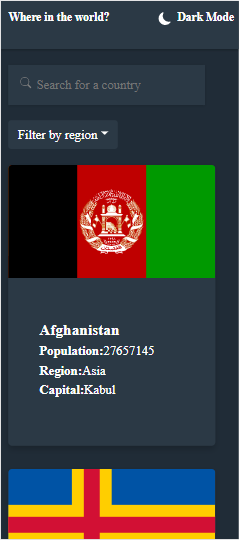

# Frontend Mentor - REST Countries API with color theme switcher solution

This is a solution to the [REST Countries API with color theme switcher challenge on Frontend Mentor](https://www.frontendmentor.io/challenges/rest-countries-api-with-color-theme-switcher-5cacc469fec04111f7b848ca). Frontend Mentor challenges help you improve your coding skills by building realistic projects. 

## Table of contents

- [Frontend Mentor - REST Countries API with color theme switcher solution](#frontend-mentor---rest-countries-api-with-color-theme-switcher-solution)
  - [Table of contents](#table-of-contents)
  - [Overview](#overview)
    - [The challenge](#the-challenge)
    - [Screenshots](#screenshots)
      - [Main Page light mode](#main-page-light-mode)
    - [Main page dark mode](#main-page-dark-mode)
    - [Detail Page Light Mode](#detail-page-light-mode)
    - [Detail Page Dark Mode](#detail-page-dark-mode)
    - [Mobile view light mode](#mobile-view-light-mode)
    - [Mobile view dark mode](#mobile-view-dark-mode)
    - [Mobile view detail](#mobile-view-detail)
    - [Links](#links)
  - [My process](#my-process)
    - [Built with](#built-with)
    - [Useful resources](#useful-resources)
  - [Author](#author)

**Note: Delete this note and update the table of contents based on what sections you keep.**

## Overview

### The challenge

Users should be able to:

- See all countries from the API on the homepage
- Search for a country using an `input` field
- Filter countries by region
- Click on a country to see more detailed information on a separate page
- Click through to the border countries on the detail page
- Toggle the color scheme between light and dark mode *(optional)*

### Screenshots
#### Main Page light mode

### Main page dark mode

### Detail Page Light Mode

### Detail Page Dark Mode

### Mobile view light mode

### Mobile view dark mode

### Mobile view detail

### Links

- Solution URL: (https://github.com/Aniket1298/rest-countries/)(https://github.com/Aniket1298/rest-countries/)
- Live Site URL: [https://60bde032f107116f7c10d1c0--worldfrontend.netlify.app/](https://60bde032f107116f7c10d1c0--worldfrontend.netlify.app/)

## My process

### Built with

- Semantic HTML5 markup
- CSS custom properties
- Flexbox
- Mobile-first workflow
- [React](https://reactjs.org/) - JS library
- [Bootstrap](https://getbootstrap.com/) - Css framework

### Useful resources

- [stackoverflow](https://stackoverflow.com/).
- [Reactjs](http://reactjs.org)

## Author

- Frontend Mentor - [https://www.frontendmentor.io/profile/Aniket1298](https://www.frontendmentor.io/profile/yourusername)
- Twitter - [https://twitter.com/Aniket74169420](https://www.twitter.com/yourusername)